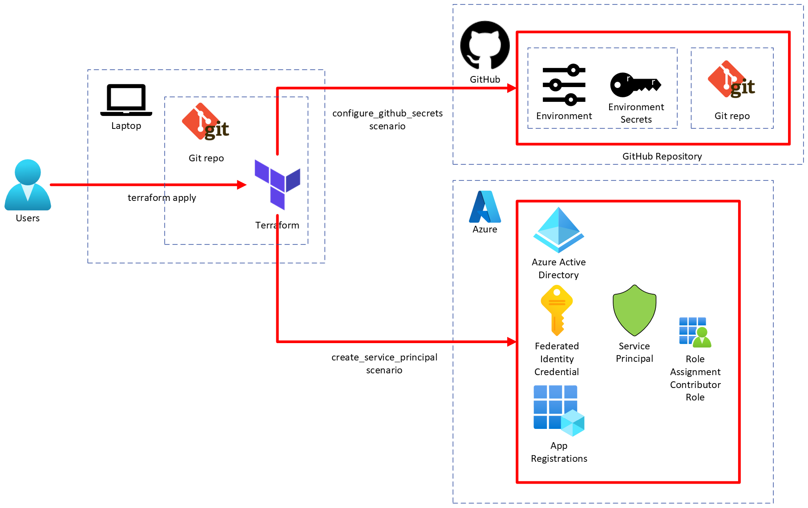

# Use GitHub Actions to connect to Azure with OpenID Connect

Use Terraform to automate the configuration of OpenID Connect (OIDC) to securely connect to Azure with GitHub Actions.

[Azure Provider: Authenticating via a Service Principal and OpenID Connect](https://registry.terraform.io/providers/hashicorp/azurerm/latest/docs/guides/service_principal_oidc)

## Architecture

**Configure OpenID Connect to authenticate with Azure from GitHub Actions**



### 1. Create a service principal and configure OpenID Connect to authenticate with Azure.

```shell
# Move to the scenario directory
cd infra/scenarios/create_service_principal

# Authenticate with Azure via Azure CLI
az login

# (Optional) Confirm the details for the currently logged-in user
az ad signed-in-user show

# Set environment variables
export ARM_SUBSCRIPTION_ID=$(az account show --query id --output tsv)
export TF_VAR_service_principal_name="baseline-environment-on-azure-terraform_tf"
export TF_VAR_github_environment="tf"

# Initialize the Terraform configuration.
terraform init

# Deploy the infrastructure
terraform apply -auto-approve

# Grant permissions to the application
application_object_id=$(terraform output -raw application_object_id)
az ad app permission admin-consent --id $application_object_id
```

### 2. Configure GitHub secrets

```shell
# Move to the scenario directory
cd infra/scenarios/configure_github_secrets

# Authenticate with Azure via Azure CLI
az login

# (Optional) Confirm the details for the currently logged-in user
az ad signed-in-user show

# Retrieve the required information.
APPLICATION_NAME="baseline-environment-on-azure-terraform_$TF_VAR_github_environment"
APPLICATION_ID=$(az ad sp list --display-name "$APPLICATION_NAME" --query "[0].appId" --output tsv)
SUBSCRIPTION_ID=$(az account show --query id --output tsv)
TENANT_ID=$(az account show --query tenantId --output tsv)

# Create the tfvars file
cat <<EOF > terraform.tfvars
create_github_repository = "false"
organization = "ks6088ts-labs"
repository_name = "baseline-environment-on-azure-terraform"
environment_name = "$TF_VAR_github_environment"
actions_environment_secrets = [
    {
        name  = "ARM_CLIENT_ID"
        value = "$APPLICATION_ID"
    },
    {
        name  = "ARM_SUBSCRIPTION_ID"
        value = "$SUBSCRIPTION_ID"
    },
    {
      name  = "ARM_TENANT_ID"
      value = "$TENANT_ID"
    },
    {
      name  = "ARM_USE_OIDC"
      value = "true"
    },
]
EOF

# Initialize the Terraform configuration.
terraform init

# Deploy the infrastructure
terraform apply -auto-approve
```

### 3. Use GitHub Actions to connect to Azure

```yaml
name: deploy

on:
  workflow_dispatch:
    inputs:
      scenario:
        type: string
        required: true
        description: "Scenario to deploy"
        default: "tfstate_backend"
      environment:
        # You can select `tf` or `ci` as the environment from a dropdown list.
        type: environment
        required: true
        description: "Environment to deploy"
        default: "ci"

permissions:
  id-token: write
  contents: read

jobs:
  deploy:
    strategy:
      matrix:
        platform: [ubuntu-latest]
        terraform-version: [1.9.8]
    runs-on: ${{ matrix.platform }}
    environment: ${{ github.event.inputs.environment }}
    env:
      # Set the secret environment variables ref. https://registry.terraform.io/providers/Azure/azapi/latest/docs/guides/service_principal_oidc
      ARM_CLIENT_ID: ${{ secrets.ARM_CLIENT_ID }}
      ARM_SUBSCRIPTION_ID: ${{ secrets.ARM_SUBSCRIPTION_ID }}
      ARM_TENANT_ID: ${{ secrets.ARM_TENANT_ID }}
      ARM_USE_OIDC: ${{secrets.ARM_USE_OIDC}}
    steps:
      - name: Checkout code
        uses: actions/checkout@v4
        with:
          fetch-depth: 0
      - name: Setup Terraform
        uses: hashicorp/setup-terraform@v2
        with:
          terraform_version: ${{ matrix.terraform-version }}
      - name: deploy scenario
        run: |
          cd infra
          make deploy SCENARIO=${{ github.event.inputs.scenario }}
```
